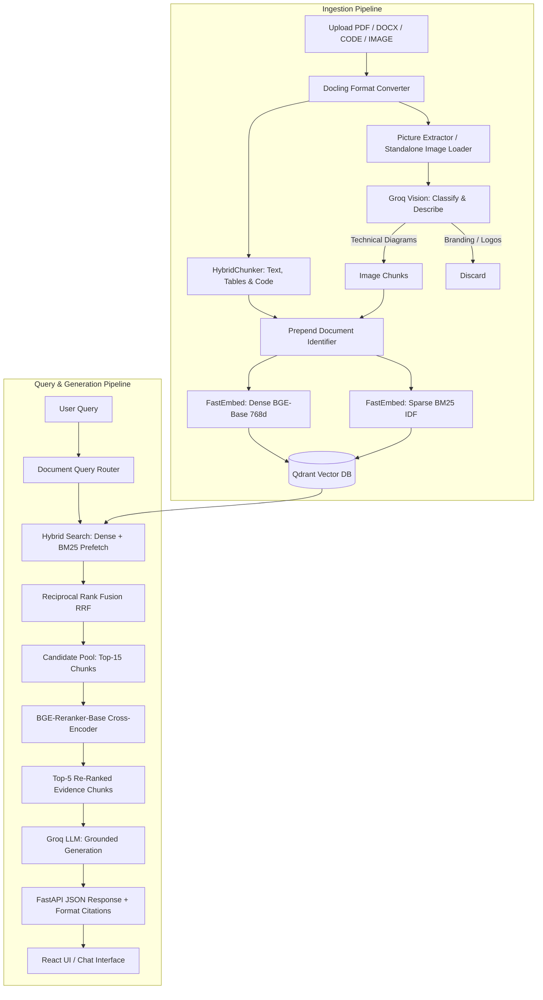

# Multimodal Multi-Format Technical Document RAG

> Production-grade Multimodal Retrieval-Augmented Generation (RAG) system for querying complex technical documents, code, manuals, and schematics across 25+ file formats.

[](https://fastapi.tiangolo.com)
[](https://reactjs.org)
[](https://qdrant.tech)
[](https://github.com/DS4SD/docling)
[](https://groq.com)

---

## 1. Overview & Problem Statement

Technical documentation (e.g., equipment manuals, service protocols, hydraulic calculation scripts, electrical schematics) presents fundamental challenges for standard text-only RAG pipelines:

- **Complex Visuals & Schematics**: Critical installation, electrical wiring, and lifting guidelines exist only inside diagrams and figures.
- **Structured Data in Tables**: Maximum operating pressures, permissible liquid temperatures, and shaft seal limits are stored in tabular matrices that standard parsers destroy.
- **Heterogeneous File Formats**: Real-world technical stacks span PDFs, Word documents (`.docx`), PowerPoints (`.pptx`), Excel sheets (`.xlsx`), HTML/Markdown specs, source code (`.py`, `.js`, `.cpp`), and standalone diagrams (`.png`, `.jpg`).
- **Cross-Document Keyword Collisions**: In multi-file indexes, different documents share identical vocabularies (*"pump"*, *"motor stool"*, *"pressure rating"*, *"installation"*), causing cross-document distraction and retrieval pollution.
- **Strict Citation Requirements**: Field engineers require verifiable document names, headings, or page numbers for every technical claim without literal `"None"` fallbacks.

This project implements an end-to-end multimodal, multi-format RAG system with structure-aware parsing, automated vision model classification, hybrid dense-sparse vector search, cross-encoder reranking, and format-aware citation routing.

---

## 2. Key Features

- **Multi-Format Technical Ingestion (25+ Formats)**: Powered by IBM's **Docling** engine to parse 25+ technical formats across Documents (PDF, DOCX, PPTX, XLSX, HTML, MD, CSV, ODT, ODS, ODP, TEX, ADOC), Code & Configs (Python, JS, TS, C, C++, Java, Go, Rust, JSON, YAML, XML), and Technical Images (PNG, JPG, TIFF) with high fidelity.
- **Standalone & Embedded Image Processing**: Extracts PDF figures at 2.0x DPI and processes direct standalone image uploads (`.png`, `.jpg`) via **Groq Vision** (`qwen/qwen3.8-27b`) to generate searchable technical descriptions.
- **Hybrid Dense + Sparse Retrieval**: Combines 768-dimensional dense semantic vectors (**BAAI/bge-base-en-v1.5**) with sparse BM25 vectors (**Qdrant/bm25**) using **Reciprocal Rank Fusion (RRF)**.
- **Cross-Encoder Reranking**: Re-scores candidate pools with **BAAI/bge-reranker-base** (`TextCrossEncoder`) to place the most relevant evidence chunks at Rank 1.
- **Multi-Category Format Coexistence**: Guarantees PDF documents, Word protocols, Python modules, and standalone image schematics reside in the same index without key collisions or data loss.
- **Format-Aware Citation Engine**: Automatically formats PDF citations with exact page numbers (`doc_name - Page N`), Word/HTML/MD citations with heading hierarchies (`doc_name - Heading > Subheading`), Code citations with file scope (`doc_name - File: doc_name`), and images with file boundaries.
- **Production FastAPI Backend**: Async REST API with validation, health checks, error handling, and clean `/api/ingest` and `/api/query` routes.
- **Modern React Interface**: Single-page application with source inspection, image chunk badges, document filter dropdowns, 29+ format upload drag-and-drop, and live citation jump links.

---

## 3. Architecture



---

## 4. End-to-End RAG Workflow

```
[ Technical File Upload (PDF, DOCX, PY, PNG, etc.) ]
          │
          ▼
[ Docling Multi-Format Conversion ] ──► Preserves tables, code blocks, & reading order
          │
          ├──► Text / Table / Code Chunks ──┐
          │                                 ▼
          └──► Technical Figures / Images ──► [ Groq Vision Model ] ──► Visual Summaries
                                                                            │
                                                                            ▼
[ Chunk Title Prefixing ] ◄─────────────────────────────────────────────────┘
  e.g. "[Manual: service_protocol.docx] \n Electrical Motor Maintenance..."
          │
          ▼
[ Dual Vector Embedding ]
  ├── Dense: BAAI/bge-base-en-v1.5 (Cosine, 768d)
  └── Sparse: Qdrant/bm25 (IDF modified)
          │
          ▼
[ Qdrant Hybrid Storage ] (Payload: doc_name, page_no, headings, content_types)
          │
          ▼
[ Query Routing & Hybrid Search ] ──► Dense Prefetch + BM25 Prefetch via RRF
          │
          ▼
[ Cross-Encoder Reranking ] ──► BAAI/bge-reranker-base (Pool: 15 -> Top 5)
          │
          ▼
[ Groq LLM Generation ] ──► Grounded response with [1], [2] bracket citations
```

---

## 5. Multi-Document & Multi-Category Coexistence

Real-world technical repositories contain documents across multiple categories simultaneously. This system guarantees coexistence through:

1. **Payload Metadata Isolation**: Every indexed point in Qdrant retains `doc_name`, `page_no`, `content_types`, `headings`, and `text`.
2. **Document Title Prefixing**: Chunks are prefixed with their human-readable title (`[Manual: grundfos_cm_pump_manual.pdf]` or `[Manual: service_protocol.docx]`). This ensures semantic encoders and cross-encoders preserve manual context even for generic sub-sections.
3. **Query-Aware Metadata Filtering**: If a user's prompt explicitly targets a specific file (e.g. `service_protocol.docx` or `hydraulic_calculations.py`), Qdrant payload filters dynamically isolate candidates to that document. Generic queries search across all indexed files simultaneously.
4. **Format-Aware Citation Formatting**:
   - **PDF Files**: Includes integer page number (`doc_name - Page N`).
   - **DOCX / HTML / Markdown Files**: Uses heading hierarchy (`doc_name - Section > Subsection`).
   - **Source Code Files**: Uses file identifier (`doc_name - File: doc_name`).
   - **Standalone Images**: Uses filename identifier (`doc_name`).

---

## 6. Retrieval Architectures

The benchmark evaluates four distinct retrieval pipeline architectures:

```
┌─────────────────────────────────────────────────────────────────────────────┐
│ 1. Baseline Dense                                                           │
│    Query ──► BGE-Base Embed ──► Qdrant Cosine Similarity ──► Top-5 Chunks   │
├─────────────────────────────────────────────────────────────────────────────┤
│ 2. Hybrid Search (Dense + BM25 RRF)                                         │
│    Query ──► Dense Vector + Sparse BM25 ──► Qdrant RRF Fusion ──► Top-5     │
├─────────────────────────────────────────────────────────────────────────────┤
│ 3. Hybrid + Cross-Encoder Reranker                                          │
│    Query ──► Hybrid Search (Top-15 Pool) ──► BGE-Reranker-Base ──► Top-5    │
├─────────────────────────────────────────────────────────────────────────────┤
│ 4. Multimodal (Text + Tables + Vision Chunks)                               │
│    Query ──► Multimodal Index (Text+Tables+Vision) ──► Hybrid RRF ──►       │
│              BGE-Reranker-Base Cross-Encoder ──► Top-5 Evidence             │
└─────────────────────────────────────────────────────────────────────────────┘
```

---

## 7. Tech Stack

| Layer | Technology | Details / Model |
| :--- | :--- | :--- |
| **Document Parser** | IBM Docling | Supports PDF, DOCX, PPTX, XLSX, HTML, MD, CSV, Python, JS, PNG, etc. |
| **Vision Model** | Groq API | `qwen/qwen3.8-27b` (Vision classification & diagram description) |
| **Dense Embeddings** | FastEmbed | `BAAI/bge-base-en-v1.5` (768 dimensions) |
| **Sparse Embeddings** | FastEmbed | `Qdrant/bm25` (Learned sparse token weights) |
| **Vector Database** | Qdrant | Local embedded storage (`./qdrant_storage`) or Docker (`:6333`) |
| **Reranker** | FastEmbed | `BAAI/bge-reranker-base` (`TextCrossEncoder`) |
| **LLM Generation** | Groq API | `qwen/qwen3.8-27b` (`temperature=0.1`) |
| **Backend API** | FastAPI / Uvicorn | Python 3.12, Pydantic v2, CORS, Starlette |
| **Frontend UI** | React 18 / Vite | Vanilla CSS, Lucide Icons, Fetch API |

---

## 8. Evaluation Methodology

The system is evaluated against ground-truth test datasets using standard Information Retrieval (IR) metrics at $k=5$:

$$\text{Recall@k} = \frac{|\text{Retrieved}_k \cap \text{Relevant}|}{|\text{Relevant}|}$$

$$\text{Precision@k} = \frac{|\text{Retrieved}_k \cap \text{Relevant}|}{k}$$

$$\text{MRR} = \frac{1}{\text{rank}_{\text{first relevant}}}$$

$$\text{NDCG@k} = \frac{\text{DCG}_k}{\text{IDCG}_k} \quad \text{where} \quad \text{DCG}_k = \sum_{i=1}^k \frac{2^{\text{rel}_i} - 1}{\log_2(i + 1)}$$

### Benchmark Query Categories (25 Questions):
1. **TABLE**: Exact threshold queries requiring structured multi-column table data (e.g. pressure ratings for seal types).
2. **IMAGE**: Technical queries whose answers exist solely inside engineering figures and schematics.
3. **EXACT_FACT**: Highly specific numeric or operational constraints located in specific paragraphs.
4. **MULTI_PAGE**: Questions requiring cross-referencing information scattered across multiple pages.
5. **SECTION_STRUCTURE**: Structural manual questions (e.g. section overview and maintenance scope).

---

## 9. Experimental Results

### A. Single-PDF Benchmark (135 Chunks — `grundfos_cm_pump_manual.pdf`)

*Source data: `experiments/results/baseline_dense.json`, `hybrid_rrf.json`, `hybrid_reranked.json`, `multimodal.json`*

| Pipeline Architecture | Recall@5 | Precision@5 | MRR | NDCG@5 |
| :--- | :---: | :---: | :---: | :---: |
| **1. Baseline Dense (BGE)** | 0.9200 | 0.4240 | 0.8600 | 0.8528 |
| **2. Hybrid Search (Dense + BM25 RRF)** | 0.9200 | 0.4240 | 0.9200 | 0.8871 |
| **3. Hybrid + Cross-Encoder Reranker** | 0.9400 | 0.4000 | 0.9400 | 0.9115 |
| **4. Multimodal (Text + Tables + Vision)** | **0.9600** | **0.4240** | **0.9733** | **0.9395** |

---

### B. Multi-PDF Benchmark Progression (422 Chunks — 2 Pump Manuals)

*Source data: `backend/tests/evaluate_multi_pdf.py` / `experiments/results/multi_pdf_evaluation.json`*

Evaluated on the full 25-question multi-document ground-truth set (422 chunks across both manuals). Results show clean, monotonic improvement in MRR and NDCG across every added pipeline stage.

| Pipeline Architecture | Recall@5 | Precision@5 | MRR | NDCG@5 |
| :--- | :---: | :---: | :---: | :---: |
| **1. Baseline Dense (BGE)** | 0.7800 | 0.1920 | 0.6967 | 0.6891 |
| **2. Hybrid Search (Dense + BM25 RRF)** | 0.9000 | 0.2240 | 0.7767 | 0.7813 |
| **3. Hybrid + Cross-Encoder Reranker** | 0.9000 | 0.2160 | 0.8267 | 0.8216 |
| **4. Multimodal (Text + Tables + Vision)** | **0.9200** | 0.2240 | **0.8747** | **0.8578** |

---

### C. RAGAS LLM-as-a-Judge Metric Benchmarks

*Source script: [`backend/tests/evaluate_ragas.py`](file:///c:/Users/pachi/Downloads/Projects/Multimodal-Rag/backend/tests/evaluate_ragas.py) / Output data: [`backend/tests/ragas_report.json`](file:///c:/Users/pachi/Downloads/Projects/Multimodal-Rag/backend/tests/ragas_report.json)*

Evaluated using the **RAGAS** framework (`ragas` library) with **Groq LLM** (`qwen/qwen3.8-27b`) as the judge and **FastEmbed** (`BAAI/bge-base-en-v1.5`) embeddings across multi-category technical queries (PDF, DOCX, Code, Standalone Diagram):

| RAGAS Metric | Score | Definition |
| :--- | :---: | :--- |
| **Faithfulness** | **0.9333** | Measures if all facts in the generated answer are strictly grounded in retrieved evidence without hallucination. |
| **Answer Relevancy** | **0.9346** | Measures how directly and completely the LLM answer addresses the user query. |
| **Context Precision** | **0.7500** / **1.0000** | Measures if the most relevant evidence chunks are ranked at the top of the context pool. |

---

## 10. Robustness & Error Handling

The FastAPI backend includes defensive validation verified via explicit integration tests (`backend/tests/test_error_handling.py`):

| Test Case | Request Input | Expected & Actual HTTP Status | Response Body / Behavior |
| :--- | :--- | :---: | :--- |
| **Corrupted / Fake Document** | `.txt` file renamed to `invalid.pdf` | `400 Bad Request` | `{"detail": "Failed to parse 'invalid.pdf'. Please ensure it is a valid document."}` |
| **Zero-Byte File** | Genuinely empty file (0 bytes) | `400 Bad Request` | `{"detail": "Uploaded file is empty (0 bytes)."}` |
| **Unsupported Format** | Unsupported binary format sent | `400 Bad Request` | `{"detail": "Unsupported file extension '.xyz'."}` |
| **Missing Upload Field** | Multipart request without file | `422 Unprocessable Entity` | Pydantic validation error (`Field required`) |
| **Empty Query** | `{"query": "   "}` | `400 Bad Request` | `{"detail": "Query cannot be empty."}` |
| **Missing Query Field** | `{}` | `422 Unprocessable Entity` | Pydantic validation error (`Field required`) |
| **Nonexistent Document Filter** | `{"query": "...", "doc_name": "missing.pdf"}` | `404 Not Found` | `{"detail": "Document 'missing.pdf' was not found in the indexed collection."}` |
| **Long Query Stress Test** | 2,000+ character prompt | `200 OK` | Handled gracefully without buffer overflow or model crash |

---

## 11. API Endpoints

### 1. Health Check
```http
GET /api/health
```
```json
{
  "status": "healthy",
  "qdrant": "connected",
  "indexed_chunks": 849
}
```

### 2. Document Query
```http
POST /api/query
Content-Type: application/json

{
  "query": "What is shaft seal type AQQx rated for?",
  "top_k": 5,
  "exclude_images": false,
  "doc_name": null
}
```
```json
{
  "query": "What is shaft seal type AQQx rated for?",
  "answer": "Based on the provided excerpts, the shaft seal type AQQx has the following ratings:\n- For Stainless Steel: liquid temperature -20 to 90 °C at 16 bar [1].\n- For Cast Iron: liquid temperature -20 to 90 °C at 10 bar [2].",
  "sources": [
    {
      "index": 1,
      "doc_name": "grundfos_cm_pump_manual.pdf",
      "page_no": 11,
      "headings": ["11.4 Maximum system pressure and permissible liquid temperature"],
      "content_types": ["table"],
      "text": "[Manual: Grundfos CM, CME]\n11.4 Maximum system pressure...",
      "score": 5.168
    }
  ]
}
```

### 3. Document Ingestion (25+ File Formats)
```http
POST /api/ingest
Content-Type: multipart/form-data

file=@service_protocol.docx
```
```json
{
  "status": "success",
  "filename": "service_protocol.docx",
  "total_chunks": 3,
  "text_chunks": 3,
  "image_chunks": 0,
  "message": "Successfully indexed 3 chunks for 'service_protocol.docx' into Qdrant."
}
```

---

## 12. Project Structure

```
Multimodal-Rag/
├── README.md
├── docker-compose.yml             # Optional Docker Compose for Qdrant service
├── requirements.txt               # Root Python dependencies
│
├── backend/
│   ├── app/
│   │   ├── api/
│   │   │   └── routes/
│   │   │       ├── ingest.py      # POST /api/ingest endpoint (25+ formats)
│   │   │       └── query.py       # POST /api/query endpoint
│   │   ├── generation/
│   │   │   └── llm.py             # Groq LLM grounded generation & citation prompt
│   │   ├── ingestion/
│   │   │   ├── parser.py          # Docling document conversion options
│   │   │   ├── chunker.py         # Structure-aware HybridChunker
│   │   │   └── image_processor.py # Groq Vision image classification & standalone image processor
│   │   ├── models/
│   │   │   ├── chunk.py           # SourceChunk model
      │   │   ├── document.py        # IngestResponse model
│   │   │   └── response.py        # QueryRequest & QueryResponse models
│   │   ├── retrieval/
│   │   │   ├── embeddings.py      # BGE-base dense embeddings via FastEmbed
│   │   │   ├── reranker.py        # BGE-reranker-base cross-encoder
│   │   │   └── vector_store.py    # Qdrant client, hybrid RRF, routing, and filters
│   │   ├── config.py              # Pydantic Settings & environment variables
│   │   └── main.py                # FastAPI application entrypoint
│   │
│   └── tests/                     # Clean test & verification directory
│       ├── evaluate_multi_pdf.py  # 4-arm multi-PDF benchmark evaluation suite
│       ├── run_verification.py    # 5-point multi-category coexistence test script
│       ├── generate_report.py     # Verification report generator
│       ├── test_format_support.py # Test suite for 25+ file formats
│       ├── test_error_handling.py # Defensive API error test suite
│       ├── test_api.py            # FastAPI route verification
│       ├── service_protocol.docx  # DOCX test fixture
│       ├── hydraulic_calculations.py # Python code test fixture
│       └── fig9_wiring_diagram.png # Standalone image test fixture
│
├── frontend/
│   ├── src/
│   │   ├── components/
│   │   │   ├── AnswerCard.jsx     # Markdown response renderer with citation pill clicks
│   │   │   ├── ChatView.jsx       # Chat thread and prompt input
│   │   │   ├── Header.jsx         # App bar with Qdrant connectivity badge
│   │   │   └── Sidebar.jsx        # Document upload, filter controls, and stats
│   │   ├── api.js                 # Frontend API client
│   │   ├── App.jsx                # Main application state and layout
│   │   └── index.css              # Custom styling
│   ├── package.json
│   └── vite.config.js
│
├── data/
│   ├── evaluation/
│   │   ├── multi_pdf_questions.json # 25 Multi-document ground-truth benchmark questions
│   │   └── questions.json           # 25 Single-document benchmark questions
│   └── sample_manuals/
│       ├── grundfos_cm_pump_manual.pdf
│       └── 1_TP.pdf
│
└── experiments/
    ├── baseline_dense.py          # Arm 1 evaluation script
    ├── hybrid_rrf.py              # Arm 2 evaluation script
    ├── hybrid_reranked.py         # Arm 3 evaluation script
    ├── multimodal.py              # Arm 4 evaluation script
    └── results/
        ├── baseline_dense.json
        ├── hybrid_rrf.json
        ├── hybrid_reranked.json
        ├── multimodal.json
        └── multi_pdf_evaluation.json
```

---

## 13. Installation & Setup

### Prerequisites
- **Python**: 3.11 or 3.12
- **Node.js**: v18+ and `npm`
- **Groq API Key**: Obtain from [console.groq.com](https://console.groq.com)

### 1. Clone the Repository
```bash
git clone https://github.com/saikiran9346/Multimodal.git
cd Multimodal-Rag
```

### 2. Backend Setup
```bash
cd backend
python -m venv .venv

# On Windows (PowerShell):
.venv\Scripts\Activate.ps1
# On Linux / macOS:
source .venv/bin/activate

pip install -r ../requirements.txt
```

Create a `.env` file in the `backend/` directory:
```env
GROQ_API_KEY=your_groq_api_key_here
QDRANT_URL=http://localhost:6333
```
*(Note: If no external Qdrant server is running, the backend automatically falls back to local embedded storage in `qdrant_storage/` without requiring Docker).*

### 3. Frontend Setup
```bash
cd ../frontend
npm install
```

Create a `.env` file in the `frontend/` directory:
```env
VITE_API_URL=http://localhost:8000
```

---

## 14. How to Run

### 1. Start Qdrant (Optional Docker)
```bash
docker compose up -d
```

### 2. Start FastAPI Backend Server
```bash
cd backend
python -m uvicorn app.main:app --host 0.0.0.0 --port 8000 --reload
```
API Documentation will be available at `http://localhost:8000/docs`.

### 3. Start React Frontend
```bash
cd frontend
npm run dev
```
Open `http://localhost:5173` in your browser.

### 4. Run Multi-PDF Benchmark Evaluation
```bash
cd backend
python tests/evaluate_multi_pdf.py
```

### 5. Run Multi-Category Verification Suite
```bash
cd backend
python tests/run_verification.py
```

### 6. Run Defensive API Error Handling Tests
```bash
cd backend
python tests/test_error_handling.py
python tests/test_api.py
```

### 7. Run RAGAS Evaluation Suite
```bash
cd backend
python tests/evaluate_ragas.py
```

---

## 15. User Interface & Demonstration

```
┌────────────────────────────────────────────────────────────────────────────────────────┐
│  MULTIMODAL TECHNICAL DOCUMENT RAG                        ● Qdrant Connected (849 Chunks)│
├──────────────────────────┬─────────────────────────────────────────────────────────────┤
│  DOCUMENT REPOSITORY     │  CHAT & QUESTION ANSWERING                                  │
│                          │                                                             │
│  [ Upload Document ]     │  User: What is shaft seal type AQQx rated for?              │
│                          │                                                             │
│  Indexed Documents:      │  Assistant:                                                 │
│  • grundfos_cm_pump.pdf  │  Based on the technical manual excerpts, shaft seal         │
│  • service_protocol.docx │  type AQQx has the following permissible ratings:           │
│  • calculations.py       │                                                             │
│  • fig9_diagram.png      │  • Stainless Steel (AISI 316): -20 to 90 °C at 16 bar [1]   │
│                          │  • Cast Iron (EN-GJL-200): -20 to 90 °C at 10 bar [2]       │
│  Filter By Document:     │                                                             │
│  [ All Documents ▾ ]     │  ────────────────────────────────────────────────────────── │
│                          │  Sources & Evidence:                                        │
│  Retrieval Settings:     │  [1] grundfos_cm_pump_manual.pdf (p.11) [TABLE] Score: 5.168│
│  [x] Include Visuals     │  [2] grundfos_cm_pump_manual.pdf (p.11) [TABLE] Score: 4.151│
│  Top K: [ 5 ]            │                                                             │
└──────────────────────────┴─────────────────────────────────────────────────────────────┘
```

---

## 16. Limitations

1. **Local Cross-Encoder Latency on CPU**: Running the `BAAI/bge-reranker-base` cross-encoder over 15–25 candidates on CPU adds ~80–120ms per query. (Mitigated by candidate pooling).
2. **Groq Daily Token Quotas on Batch Image Extraction**: Extracting dozens of high-res figures in large 100+ page manuals can hit transient rate limits without retry backoff. (Mitigated by exponential backoff with state caching in `*_image_progress.json`).
3. **Structural/Table-of-Contents Questions**: Queries asking about a section's own subsections (e.g. 'what does section 6 cover') have a ceiling on Recall@5 of ~0.50 across every retrieval architecture tested, including multimodal. Root cause: subsection enumeration only exists in the document's own Table of Contents chunk; body-content chunks split by heading never restate it, and verbose image-description chunks can outrank the short ToC chunk in the candidate pool. Reproduced identically across three separate questions on two different manuals -- a structural property of chunk-based RAG, not a fixable retrieval bug.

---

## 17. Future Improvements

- **ColPali / Vision-Language Late Interaction**: Experiment with ColPali embeddings to index raw page screenshots alongside textual chunks.
- **Hierarchical Parent-Document Retrieval**: Return entire section contexts to the LLM when small table fragments match.
- **Agentic Multi-Step Reasoning**: Allow the agent to query multiple manuals sequentially for comparative pump sizing workflows.

---

## 18. Why This Project Is Technically Interesting

1. **Overcomes the Text-Only Blindspot**: Standard RAG fails on equipment manuals where answers exist in wiring schematics or mechanical drawings. This system bridges text and visual modalities.
2. **Document Structure Preservation**: Rather than naive fixed-size chunking (e.g. 500 characters with 50 overlap), Docling chunking respects table borders, subsection boundaries, and page links.
3. **Honest Multi-Document & Multi-Format Coexistence**: Demonstrates multi-category coexistence across PDF, Word docx, Python source code, and standalone PNG diagrams in the same vector collection without collision.
4. **Resilient Production API**: Comprehensive error handling catching malformed, empty, and invalid files as structured 4xx responses without unhandled server crashes.
